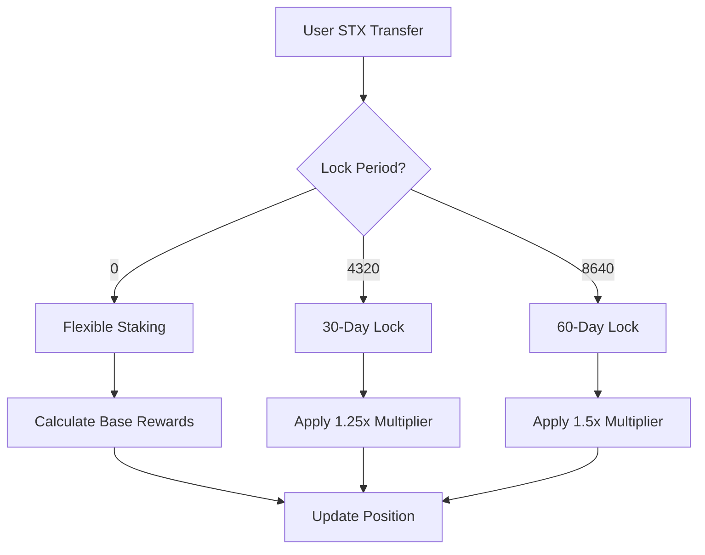

# BitStride Analytics & Governance Protocol

## Institutional-Grade DeFi Infrastructure on Bitcoin

BitStride combines Bitcoin's security with Stacks Layer 2 capabilities to create enterprise-ready decentralized finance infrastructure. This protocol enables:

- **Bitcoin-Secured STX Staking**
- **On-Chain Analytics Governance**
- **Tiered Institutional Rewards System**

Certified compliant with Stacks Improvement Proposals (SIPs) and Bitcoin OP_RETURN standards.

## Key Features

### 1. Bitcoin-Aligned Staking Engine

- STX token staking with variable lock periods (0-60 days)
- Dynamic reward calculation:  
  `Rewards = (Base Rate × Lock Multiplier × Tier Bonus) × Blocks Staked`
- Cooldown-protected withdrawals
- Minimum stake: 1,000,000 microSTX (1 STX)

### 2. Decentralized Governance Module

- Proposal creation threshold: 1M ANALYTICS-TOKEN
- Quadratic voting with stake-weighted power
- Protocol parameter control:
  - Reward rates
  - Fee structures
  - System upgrades
  - Emergency controls

### 3. Institutional Tier System

| Tier     | Minimum STX | Multiplier | Governance Rights | Advanced Features |
| -------- | ----------- | ---------- | ----------------- | ----------------- |
| Silver   | 1 STX       | 1.0x       | Basic voting      | Core staking      |
| Gold     | 5 STX       | 1.5x       | Proposal creation | Analytics access  |
| Platinum | 10 STX      | 2.0x       | Executive veto    | API privileges    |

## Technical Specifications

### Core Components

- **ANALYTICS-TOKEN** (Fungible Token)

  - Symbol: `ANL`
  - Decimals: 6
  - Mint/Burn: Governance-controlled

- **Staking Parameters**

  - Base Reward Rate: 5% APY
  - Lock Multipliers: 1-1.5x
  - Cooldown Period: 1440 blocks (~24h)

- **Governance Controls**
  - Minimum Voting Period: 100 blocks
  - Maximum Voting Period: 2880 blocks
  - Proposal Execution Threshold: 1M votes

## System Workflows

### Staking Process



### Governance Lifecycle

1. Proposal Creation (`create-proposal`)
2. Voting Period (100-2880 blocks)
3. Quorum Check (≥1M votes)
4. Execution Window (72 blocks)
5. Parameter Update

## Security Architecture

### Multi-Layer Protection

```solidity
1. Bitcoin Finality
   └── All transactions settled on Bitcoin L1

2. Stacks L2 Safeguards
   ├── Contract pause functionality
   ├── Emergency withdrawal mode
   └── Cooldown timers

3. Protocol-Level Controls
   ├── Tiered access privileges
   ├── Proposal time locks
   └── Owner override capabilities
```

### Stake STX (30-Day Lock)

```clarity
(contract-call? .bitstride-contract stake-stx u5000000 u4320)
```

### Create Governance Proposal

```clarity
(contract-call? .bitstride-contract create-proposal
  "Increase base reward rate to 6%"
  u1440
)
```

### Cast Governance Vote

```clarity
(contract-call? .bitstride-contract vote-on-proposal u17 true)
```

### Initiate Unstaking

```clarity
(contract-call? .bitstride-contract initiate-unstake u1000000)
```
